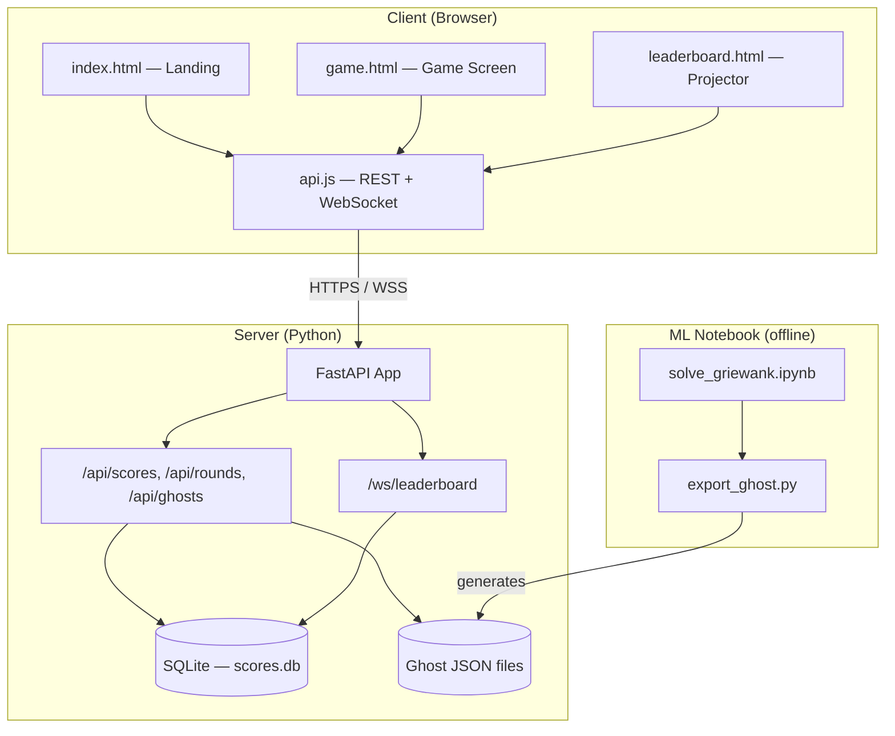

# Design Document: OptimGame

## Overview

OptimGame is a web-based optimization game where players manipulate sliders to minimize the Griewank function. The architecture is a static frontend (vanilla JS, no build step) communicating with a FastAPI backend via REST and WebSocket. An offline ML notebook generates ghost data consumed by the frontend's AI mode.

The system is designed to be deployed as a single process serving both the API and static files, accessible from a single URL.

## Architecture



## Components and Interfaces

### Component 1: Griewank Function (frontend/js/griewank.js)

```javascript
export function griewank(x: number[]): number
export function griewank1D(x: number): number
export function griewank2D(x1: number, x2: number): number
export function linspace(start: number, end: number, steps: number): number[]
```

**Responsibilities:**
- Evaluate f(x) = 1 + (1/4000)·Σxᵢ² - Πcos(xᵢ/√i)
- Provide convenience wrappers for visualisation
- Provide linspace utility for plot axes

### Component 2: Slider Manager (frontend/js/sliders.js)

```javascript
export function createSliders(container, levelConfig, onChange): SliderController
// SliderController = { getValues(), setValues(values), destroy() }
```

**Responsibilities:**
- Dynamically create N sliders based on level configuration
- Fire onChange callback with current values array on any slider input
- Provide getValues/setValues for external access
- Random non-zero starting positions

### Component 3: Visualisation (frontend/js/visualisation.js)

```javascript
export function createVisualisation(canvas): VisRenderer
// VisRenderer = { draw1D(x, range), draw2D(x1, x2, range), clear(), resize() }
```

**Responsibilities:**
- Render 1D Griewank line plot with player position marker
- Render 2D Griewank contour heatmap with player crosshair
- DPR-aware canvas rendering
- Cached heatmap (only recompute on resize/range change)

### Component 4: Game State Machine (frontend/js/game.js)

```javascript
export const LEVELS: LevelConfig[]
export const MODES: { EXPLORE, CHALLENGE, AI }
export function initGame(elements): GameState
```

**Responsibilities:**
- Orchestrate sliders, visualisation, and scoring
- Manage level switching and mode-specific behaviour
- Track evaluation budget (Challenge/AI modes)
- Colour-code function value display
- Record player path

### Component 5: Ghost Replay (frontend/js/ghost.js)

```javascript
export function createGhostPlayer(canvas, levelConfig): GhostPlayer
// GhostPlayer = { start(ghostData), stop(), isPlaying() }
```

**Responsibilities:**
- Load ghost JSON data
- Replay positions on a timer (1 eval/second)
- Render ghost dot (lavender) on visualisation
- Display ghost's current eval count and function value

### Component 6: API Client (frontend/js/api.js)

```javascript
export function submitScore(scoreData): Promise<{rank, total_players}>
export function getScores(roundId): Promise<ScoreList>
export function getRound(): Promise<RoundInfo>
export function getGhost(level): Promise<GhostData>
export function connectLeaderboard(roundId, onUpdate): WebSocketConnection
```

**Responsibilities:**
- REST calls to backend
- WebSocket connection management with auto-reconnect
- Fallback polling if WebSocket fails

### Component 7: Backend API (backend/)

**Endpoints:**
- `POST /api/scores` — Submit score, return rank
- `GET /api/scores?round_id=X` — Leaderboard for round
- `GET /api/rounds` — Current round state
- `POST /api/rounds` — Create/advance round (PIN-protected)
- `GET /api/ghosts/:level` — Ghost data for level
- `WS /ws/leaderboard?round_id=X` — Real-time score updates

## Data Models

### Level Configuration

```javascript
{
  id: 1,
  name: "Level 1",
  dimensions: 1,
  range: [-5, 5],
  budget: 40,
  description: "1D — One slider, visible landscape"
}
```

### Score Submission

```json
{
  "nickname": "alice_42",
  "level": 2,
  "score": 0.0021,
  "evals_used": 28,
  "path": [[1.2, -0.5], [0.8, -0.3]],
  "round_id": "round_2024_01"
}
```

### Ghost Data

```json
{
  "level": 2,
  "dimensions": 2,
  "algorithm": "CMA-ES",
  "budget": 30,
  "path": [
    {"eval": 1, "position": [2.5, -1.3], "value": 4.231},
    {"eval": 2, "position": [1.8, -0.9], "value": 2.107}
  ],
  "final_position": [0.001, -0.002],
  "final_value": 0.00003
}
```

### SQLite Schema

```sql
CREATE TABLE rounds (
    id TEXT PRIMARY KEY,
    mode TEXT NOT NULL DEFAULT 'challenge',
    levels_open TEXT NOT NULL DEFAULT '[1,2,3]',
    ai_mode_unlocked INTEGER NOT NULL DEFAULT 0,
    started_at TEXT NOT NULL,
    ended_at TEXT
);

CREATE TABLE scores (
    id TEXT PRIMARY KEY,
    round_id TEXT NOT NULL REFERENCES rounds(id),
    nickname TEXT NOT NULL,
    level INTEGER NOT NULL,
    score REAL NOT NULL,
    evals_used INTEGER NOT NULL,
    path TEXT,
    submitted_at TEXT NOT NULL
);
```

## Colour Palette (Catppuccin Mocha)

All colours defined as CSS custom properties in style.css:

| Role | Variable | Hex |
|------|----------|-----|
| Background | --base | #1e1e2e |
| Surface | --surface0 | #313244 |
| Primary accent | --teal | #94e2d5 |
| Secondary accent | --mauve | #cba6f7 |
| Player marker | --yellow | #f9e2af |
| Ghost marker | --lavender | #b4befe |
| Success | --green | #a6e3a1 |
| Warning | --peach | #fab387 |
| Danger | --red | #f38ba8 |

## Error Handling

### WebSocket Disconnection
- Auto-reconnect with exponential backoff (1s, 2s, 4s, max 10s)
- Show "Reconnecting..." status indicator
- Fallback to 3-second polling if WebSocket unavailable

### Score Submission Failure
- Retry once after 2 seconds
- Show error message if both attempts fail
- Store score in localStorage as backup

### Invalid Game State
- If URL params are missing, redirect to landing page
- If round is not active, show "Waiting for round to start" message

## Performance Considerations

- No build step, no bundler — files served as-is (< 50KB total JS)
- Griewank evaluation is O(N) — trivial for N ≤ 10
- Canvas heatmap is cached (only recomputed on resize)
- WebSocket for leaderboard (no polling overhead in normal operation)
- System fonts only — no web font downloads
