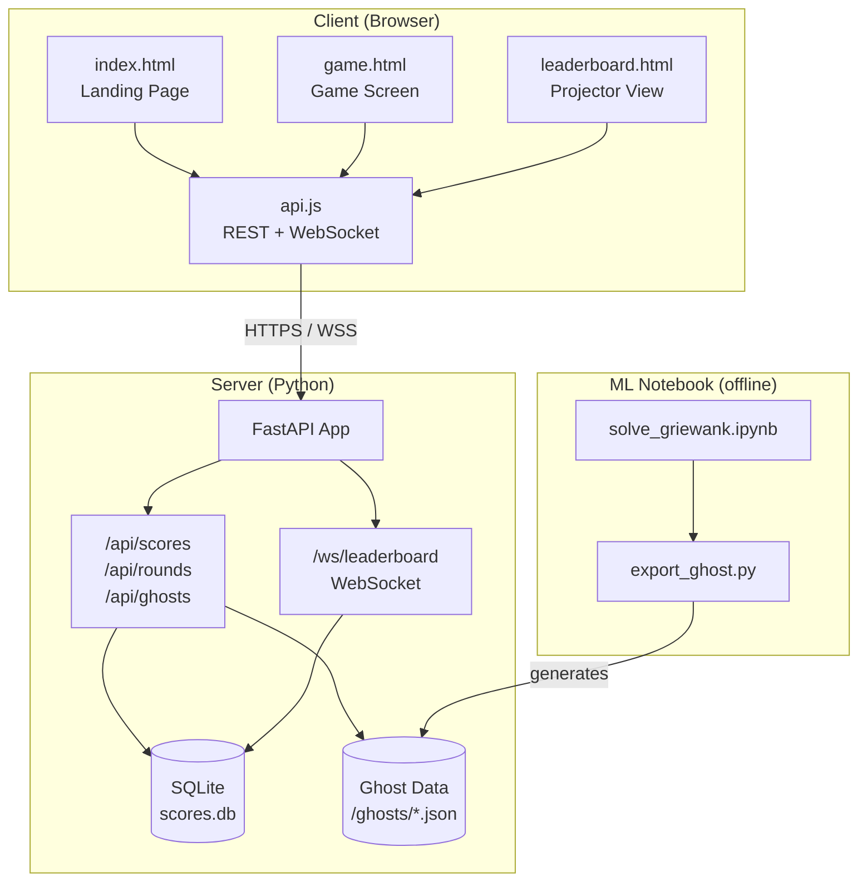
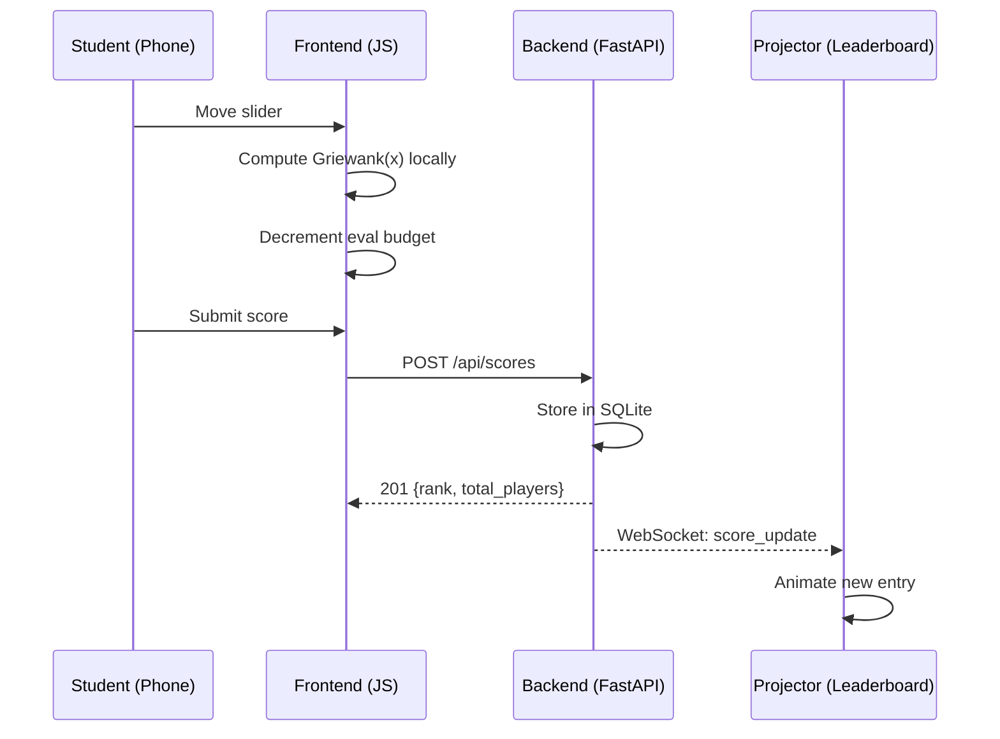
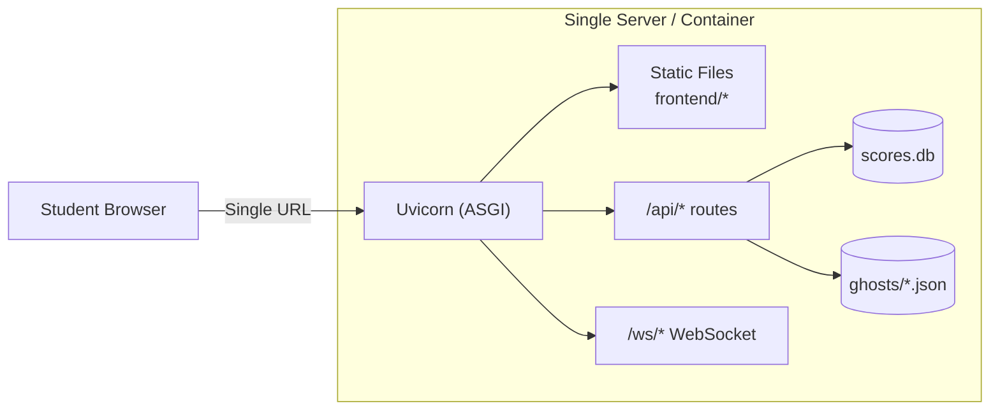

# Architecture Document — OptimGame

## System Overview



### Data Flow



### Deployment Topology



## Tech Stack

### Frontend

| Technology | Version | Purpose |
|------------|---------|---------|
| HTML5 | - | Page structure |
| CSS3 (custom properties) | - | Styling with Catppuccin palette as CSS vars |
| Vanilla JavaScript (ES2020+) | - | Game logic, DOM manipulation, API calls |
| Canvas API | - | 1D line plots, 2D contour/heatmap visualisations |
| WebSocket API (native) | - | Real-time leaderboard updates |
| noUiSlider | 15.x | Accessible, touch-friendly range sliders |

No build step. No bundler. No framework. Files are served as-is. This is intentional — students can read the source directly, and the lecture doesn't waste time on toolchain setup.

### Backend

| Technology | Version | Purpose |
|------------|---------|---------|
| Python | 3.11+ | Runtime |
| FastAPI | 0.100+ | HTTP framework + WebSocket support |
| Uvicorn | 0.23+ | ASGI server |
| SQLite | 3.x (stdlib) | Score persistence |
| Pydantic | 2.x | Request/response validation |

### ML Notebook

| Technology | Version | Purpose |
|------------|---------|---------|
| Python | 3.11+ | Runtime |
| Jupyter / JupyterLab | Latest | Interactive development |
| NumPy | 1.24+ | Numerical computation |
| SciPy | 1.11+ | Optimizers (CMA-ES, differential evolution, basin-hopping) |
| Matplotlib | 3.7+ | Visualisation of solver paths |

### Development Tools

| Tool | Purpose |
|------|---------|
| Git | Version control, branch-per-phase strategy |
| Amazon Kiro | AI-assisted development (specs, steering, hooks) |
| Postman (MCP) | API endpoint testing |
| pytest | Backend unit tests |
| Browser DevTools | Frontend debugging, mobile emulation |

## Folder Structure

```
/
├── frontend/
│   ├── index.html              # Landing page — nickname + mode selection
│   ├── game.html               # Game screen — sliders + visualisation
│   ├── leaderboard.html        # Projector leaderboard view
│   ├── css/
│   │   └── style.css           # All styles, Catppuccin vars at top
│   ├── js/
│   │   ├── griewank.js         # Griewank function implementation
│   │   ├── game.js             # Game state machine, level logic, eval budget
│   │   ├── sliders.js          # Slider creation and event handling
│   │   ├── visualisation.js    # Canvas-based plots (1D line, 2D contour)
│   │   ├── ghost.js            # Ghost replay logic + overlay rendering
│   │   ├── leaderboard.js      # Leaderboard display + WebSocket listener
│   │   └── api.js              # REST calls + WebSocket connection management
│   └── assets/
│       └── favicon.svg         # Minimal icon
├── backend/
│   ├── main.py                 # FastAPI app, CORS, static file serving
│   ├── routes/
│   │   ├── scores.py           # POST /api/scores, GET /api/scores
│   │   ├── rounds.py           # GET/POST /api/rounds (presenter control)
│   │   └── ghosts.py           # GET /api/ghosts/:level
│   ├── models.py               # Pydantic schemas
│   ├── database.py             # SQLite connection + queries
│   ├── websocket.py            # WebSocket manager (broadcast to leaderboard clients)
│   ├── requirements.txt        # Python dependencies with pinned versions
│   └── tests/
│       ├── test_scores.py
│       ├── test_rounds.py
│       └── test_griewank.py    # Verify JS and Python implementations match
├── ml/
│   ├── solve_griewank.ipynb    # Train/run optimizers on Griewank
│   ├── export_ghost.py         # Convert optimizer traces → ghost JSON
│   └── requirements.txt        # ML-specific dependencies
├── ghosts/
│   ├── level1.json             # Pre-computed ghost for 1D
│   ├── level2.json             # Pre-computed ghost for 2D
│   ├── level3.json             # Pre-computed ghost for 5D
│   └── level4.json             # Pre-computed ghost for 10D
├── docs/
│   ├── scope.md
│   ├── design.md
│   ├── architecture.md         # (this file)
│   ├── tasks.md
│   └── pedagogical_instructions.md  # (gitignored)
├── .kiro/
│   ├── steering/               # Kiro steering files
│   └── hooks/                  # Kiro agent hooks
├── .gitignore
└── README.md
```

## API Specification

### REST Endpoints

#### `POST /api/scores`

Submit a player's score after a challenge round.

**Request:**
```json
{
  "nickname": "alice_42",
  "level": 2,
  "score": 0.0021,
  "evals_used": 28,
  "path": [[1.2, -0.5], [0.8, -0.3], ...],
  "round_id": "round_2024_01"
}
```

**Response (201):**
```json
{
  "id": "score_abc123",
  "rank": 3,
  "total_players": 34
}
```

#### `GET /api/scores?round_id=round_2024_01&limit=50`

Fetch the leaderboard for a given round.

**Response (200):**
```json
{
  "round_id": "round_2024_01",
  "scores": [
    {
      "rank": 1,
      "nickname": "alice_42",
      "level": 3,
      "score": 0.0021,
      "evals_used": 28,
      "submitted_at": "2024-03-15T10:23:45Z"
    }
  ],
  "total_players": 34
}
```

#### `GET /api/rounds`

Get current round info (what mode is active, which levels are open).

**Response (200):**
```json
{
  "current_round": "round_2024_01",
  "mode": "challenge",
  "levels_open": [1, 2, 3],
  "ai_mode_unlocked": false,
  "started_at": "2024-03-15T10:00:00Z"
}
```

#### `POST /api/rounds`

Presenter-only: create/advance round. Protected by a simple PIN header.

**Request:**
```json
{
  "action": "start_new",
  "mode": "challenge",
  "levels_open": [1, 2, 3, 4],
  "pin": "1234"
}
```

#### `GET /api/ghosts/:level`

Fetch the pre-computed ghost solution for a given level.

**Response (200):**
```json
{
  "level": 2,
  "algorithm": "CMA-ES",
  "total_evals": 30,
  "path": [
    {"eval": 1, "position": [2.5, -1.3], "value": 4.231},
    {"eval": 2, "position": [1.8, -0.9], "value": 2.107},
    {"eval": 30, "position": [0.001, -0.002], "value": 0.00003}
  ],
  "final_score": 0.00003
}
```

### WebSocket

#### `ws://host/ws/leaderboard?round_id=round_2024_01`

Persistent connection for the projector leaderboard page.

**Server → Client messages:**

```json
{
  "type": "score_update",
  "data": {
    "nickname": "bob_dev",
    "level": 2,
    "score": 0.0089,
    "rank": 4,
    "total_players": 35
  }
}
```

```json
{
  "type": "round_change",
  "data": {
    "mode": "ai_mode",
    "ai_mode_unlocked": true
  }
}
```

```json
{
  "type": "player_count",
  "data": {
    "connected": 34
  }
}
```

**Fallback:** If WebSocket is unavailable (campus firewall), the leaderboard page polls `GET /api/scores` every 3 seconds.

## Data Models

### SQLite Schema

```sql
CREATE TABLE rounds (
    id TEXT PRIMARY KEY,
    mode TEXT NOT NULL DEFAULT 'challenge',
    levels_open TEXT NOT NULL DEFAULT '[1,2,3]',
    ai_mode_unlocked INTEGER NOT NULL DEFAULT 0,
    started_at TEXT NOT NULL,
    ended_at TEXT
);

CREATE TABLE scores (
    id TEXT PRIMARY KEY,
    round_id TEXT NOT NULL REFERENCES rounds(id),
    nickname TEXT NOT NULL,
    level INTEGER NOT NULL,
    score REAL NOT NULL,
    evals_used INTEGER NOT NULL,
    path TEXT,  -- JSON array of position arrays
    submitted_at TEXT NOT NULL
);

CREATE INDEX idx_scores_round_level ON scores(round_id, level, score ASC);
CREATE INDEX idx_scores_round_rank ON scores(round_id, score ASC);
```

### Ghost Data Format (JSON files)

```json
{
  "level": 2,
  "dimensions": 2,
  "algorithm": "CMA-ES",
  "parameters": {
    "population_size": 10,
    "sigma_init": 2.0
  },
  "budget": 30,
  "path": [
    {
      "eval": 1,
      "position": [2.5, -1.3],
      "value": 4.231
    }
  ],
  "final_position": [0.001, -0.002],
  "final_value": 0.00003
}
```

## Level Configuration

| Level | Dimensions | Slider Range | Budget (Challenge) | Budget (AI mode) | Difficulty |
|-------|-----------|-------------|-------------------|-----------------|------------|
| 1 | 1 | [-5, 5] | 40 | 40 | Easy — can visualise, one slider |
| 2 | 2 | [-5, 5] | 35 | 35 | Medium — contour plot helps |
| 3 | 5 | [-5, 5] | 30 | 30 | Hard — no visualisation, 5 sliders |
| 4 | 10 | [-5, 5] | 25 | 25 | Near impossible for humans |

## The Griewank Function

Mathematical definition:

```
f(x) = 1 + (1/4000) * Σᵢ xᵢ² - Πᵢ cos(xᵢ / √i)
```

- Global minimum: f(0, 0, ..., 0) = 0
- Many local minima due to the cosine product term
- Gets harder with more dimensions (more local traps)

Implemented identically in both:
- `frontend/js/griewank.js` (client-side, for real-time slider feedback)
- `ml/solve_griewank.ipynb` (Python, for optimizer training)

Backend test `test_griewank.py` verifies both implementations produce identical outputs for the same inputs.

## Security Considerations

This is a lecture tool, not a production app. Security is minimal but sensible:

- **Presenter controls:** Protected by a PIN passed as a header (not a full auth system)
- **Input validation:** Pydantic enforces schemas on all API inputs
- **Rate limiting:** None (trusted environment, 20-60 students)
- **CORS:** Configured to allow the frontend origin only
- **No PII:** Nicknames only, no email/passwords/student IDs
- **Database:** SQLite file, no network-exposed database server

## Deployment Topology (deferred)

The application is designed to deploy as a single unit — FastAPI serves both the API and the static frontend files. One process, one port, one URL. See the deployment topology diagram in the System Overview section above.

Deployment details (Docker, AWS, Vercel, Railway, etc.) are handled in a separate session.

## Performance Targets

| Metric | Target | Rationale |
|--------|--------|-----------|
| Page load (mobile, cold) | < 2s | Lecture WiFi, no framework bloat |
| Slider → value update | < 16ms | 60fps responsiveness, no network call needed |
| Score submission → leaderboard | < 2s | Real-time feel on projector |
| WebSocket reconnect | Automatic, < 5s | Handles brief WiFi drops |
| Concurrent players | 60 | One lecture hall |
| Total JS payload | < 50KB | No bundler = no tree-shaking, so keep it tight |
