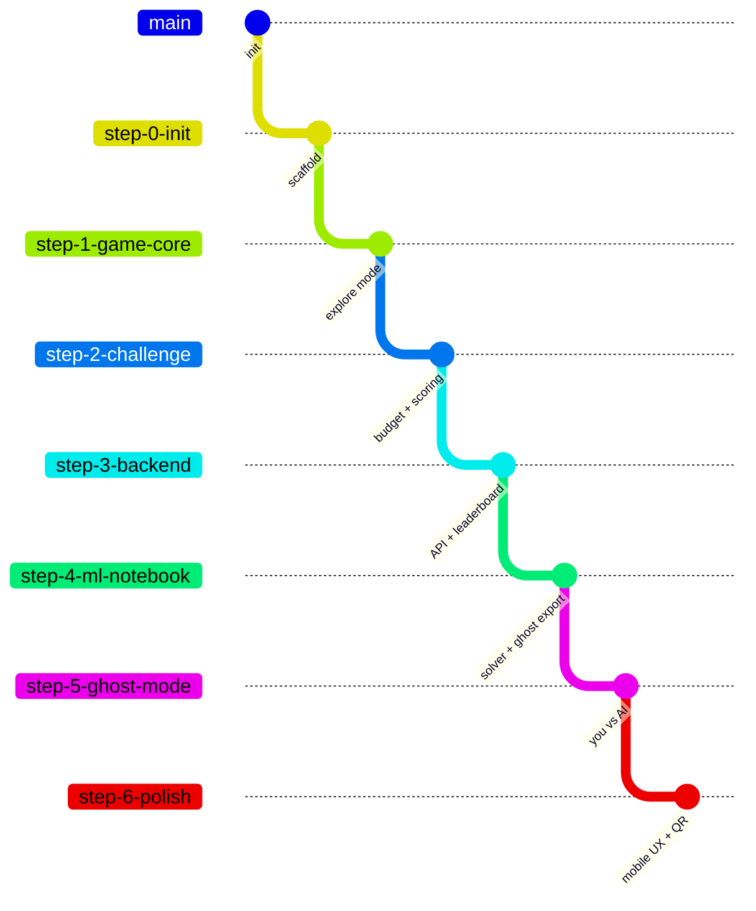

# Tasks — OptimGame Build Plan

This document outlines the phased build plan for OptimGame. Each phase maps to a git branch, lists deliverables, specifies which Kiro features and external tools are used, and defines acceptance criteria.

> For details on how Kiro's Spec workflow, steering files, hooks, and other IDE features work — and how they were used to build this project — see [docs/kiro-workflow.md](kiro-workflow.md).

## Branch Strategy

During the lecture, checkout each branch to "fast-forward" through phases. Make live edits on the branch to demo Kiro, then discard changes after (`git checkout .`) so the branch stays clean for the next session.

---

## Phase 0 — Project Scaffold

**Branch:** `step-0-init`

**Objective:** Set up the project structure, documentation, Kiro configuration, and development environment.

**Deliverables:**
- Folder structure as defined in `architecture.md`
- All documentation files (scope, design, architecture, tasks, README)
- `.kiro/steering/` with project conventions
- `.kiro/hooks/` with initial hook (lint on save)
- `.gitignore` configured
- `backend/requirements.txt` with pinned versions
- `ml/requirements.txt` with pinned versions
- Empty placeholder files for all frontend JS modules

**Kiro Features:**
| Feature | How it's used |
|---------|--------------|
| Spec session | Define requirements for the project structure |
| Steering files | Create `coding-standards.md` (vanilla JS, no frameworks, Catppuccin palette), `api-conventions.md` (response schemas, error format) |
| Autopilot mode | Generate boilerplate folder structure and placeholder files |

**Other Tools:**
| Tool | Usage |
|------|-------|
| Git | `git init`, initial commit, create branch |
| pip/uv | Verify dependencies install cleanly |

**Acceptance Criteria:**
- [ ] All folders and placeholder files exist per `architecture.md`
- [ ] `pip install -r backend/requirements.txt` succeeds
- [ ] Kiro steering files are in place and influence subsequent sessions
- [ ] `.gitignore` excludes `__pycache__`, `.env`, `scores.db`, `node_modules`, `pedagogical_instructions.md`

---

## Phase 1 — Game Core (Explore Mode)

**Branch:** `step-1-game-core`

**Objective:** Implement the Griewank function, slider UI, real-time function evaluation, and the 1D/2D visualisations. Explore mode fully playable.

**Deliverables:**
- `frontend/js/griewank.js` — Griewank function for N dimensions
- `frontend/js/sliders.js` — Dynamic slider creation based on level config
- `frontend/js/game.js` — Game state: level selection, mode (explore), value display
- `frontend/js/visualisation.js` — Canvas-based 1D line plot and 2D contour heatmap
- `frontend/css/style.css` — Full Catppuccin theme, responsive layout, component styles
- `frontend/index.html` — Landing page with nickname entry and mode selection
- `frontend/game.html` — Game screen with sliders, value display, visualisation area
- Level configuration (dimensions, slider ranges) defined in `game.js`

**Kiro Features:**
| Feature | How it's used |
|---------|--------------|
| Spec session | "Implement the Griewank function and Explore mode with real-time visualisation" |
| Supervised mode | Review generated game logic hunk-by-hunk, accept/reject |
| Steering files | Reference `design.md` via `#[[file:docs/design.md]]` for palette/component specs |
| Vibe session | "How should I structure the canvas rendering loop for 60fps updates?" |

**Other Tools:**
| Tool | Usage |
|------|-------|
| Browser DevTools | Mobile emulation, performance profiling of canvas rendering |
| Git | Commit per feature (griewank, sliders, visualisation, styling) |

**Acceptance Criteria:**
- [ ] `griewank([0, 0, ..., 0])` returns 0 for any dimension count
- [ ] Moving sliders updates the displayed function value in < 16ms
- [ ] 1D plot shows Griewank curve with player position marker
- [ ] 2D contour shows heatmap with player position dot
- [ ] Levels 3+ (5D, 10D) show sliders only, no visualisation
- [ ] Page loads in < 2s on throttled mobile connection
- [ ] Touch targets are minimum 44x44px on mobile
- [ ] Catppuccin palette applied correctly per `design.md`

---

## Phase 2 — Challenge Mode

**Branch:** `step-2-challenge`

**Objective:** Add the evaluation budget mechanic, scoring logic, score submission UI, and local score history.

**Deliverables:**
- Budget tracking in `game.js` — decrement on each slider release
- Budget display (colour-coded: teal → peach → red)
- Score calculation (final function value when budget hits 0 or player submits)
- "Submit Score" button (appears when budget exhausted or player chooses)
- Player path recording (array of positions at each eval)
- Local score display (your best per level, stored in `localStorage`)
- Level progression logic (complete level → unlock next)

**Kiro Features:**
| Feature | How it's used |
|---------|--------------|
| Spec session | "Add evaluation budget, scoring, and level progression to Challenge mode" |
| Autopilot mode | Generate budget tracking and scoring logic |
| Hooks | `PostFileSave` hook on `*.js` files → run a quick syntax check |
| Steering files | Reference `architecture.md` for level config table |

**Other Tools:**
| Tool | Usage |
|------|-------|
| Browser DevTools | Test localStorage, verify budget decrement logic |
| Git | Feature branch commits |

**Acceptance Criteria:**
- [ ] Budget decrements by 1 on each slider release (not on drag)
- [ ] Budget display changes colour at thresholds (< 10: peach, < 5: red)
- [ ] Score = function value at submission time
- [ ] Player path is recorded as array of position snapshots
- [ ] Levels unlock sequentially
- [ ] Local high scores persist across page refreshes (localStorage)
- [ ] Explore mode still has no budget (unchanged)

---

## Phase 3 — Backend + Leaderboard

**Branch:** `step-3-backend`

**Objective:** Implement the FastAPI backend, REST API, WebSocket leaderboard, and connect the frontend.

**Deliverables:**
- `backend/main.py` — FastAPI app with CORS, static file serving
- `backend/database.py` — SQLite setup, connection management, queries
- `backend/models.py` — Pydantic schemas for all request/response types
- `backend/routes/scores.py` — POST and GET score endpoints
- `backend/routes/rounds.py` — Round management (presenter controls)
- `backend/routes/ghosts.py` — Ghost data endpoint
- `backend/websocket.py` — WebSocket manager, broadcast on new scores
- `frontend/js/api.js` — REST calls + WebSocket connection
- `frontend/js/leaderboard.js` — Leaderboard rendering
- `frontend/leaderboard.html` — Projector view (full-screen, auto-updating)
- `backend/tests/` — pytest suite for all endpoints
- Presenter PIN protection on round management

**Kiro Features:**
| Feature | How it's used |
|---------|--------------|
| Spec session | "Build the leaderboard API with WebSocket real-time updates" |
| MCP (Postman) | Test API endpoints interactively during development |
| Hooks | `PostTaskExec` → run `pytest` after each completed task |
| Steering files | `api-conventions.md` enforces consistent response schemas |
| Autopilot mode | Generate CRUD routes and Pydantic models |
| Supervised mode | Review WebSocket broadcast logic carefully |

**Other Tools:**
| Tool | Usage |
|------|-------|
| pytest | Backend unit + integration tests |
| Postman (via MCP) | Manual API exploration and testing |
| curl / httpie | Quick endpoint smoke tests |
| wscat | WebSocket connection testing |
| Git | Commit per route module |

**Acceptance Criteria:**
- [ ] `POST /api/scores` validates input and returns rank
- [ ] `GET /api/scores` returns sorted leaderboard
- [ ] `POST /api/rounds` requires correct PIN
- [ ] WebSocket broadcasts score updates to all connected clients
- [ ] Leaderboard page auto-updates without refresh
- [ ] New entries animate in on the projector view
- [ ] All endpoints return proper error responses for invalid input
- [ ] `pytest` passes with > 90% route coverage
- [ ] Frontend submits scores and displays leaderboard correctly
- [ ] Fallback polling works if WebSocket fails

---

## Phase 4 — ML Notebook

**Branch:** `step-4-ml-notebook`

**Objective:** Create the Jupyter notebook that solves the Griewank function using optimization algorithms, and export the solutions as ghost data.

**Deliverables:**
- `ml/solve_griewank.ipynb` — Full notebook with:
  - Griewank function implementation (Python)
  - Multiple solvers: random search, gradient descent, CMA-ES, differential evolution
  - Comparison of solvers across dimensions (1D, 2D, 5D, 10D)
  - Visualisation of solver paths on the Griewank landscape
  - Performance metrics (evals to convergence, final value)
- `ml/export_ghost.py` — Script to convert notebook outputs → ghost JSON format
- `ghosts/level1.json` through `ghosts/level4.json` — Pre-computed ghost data
- `backend/tests/test_griewank.py` — Cross-validation between JS and Python implementations

**Kiro Features:**
| Feature | How it's used |
|---------|--------------|
| Vibe session | "Explain CMA-ES and help me implement it for the Griewank function" |
| Autopilot mode | Generate boilerplate notebook cells, plotting code |
| Multi-file context | "Read `frontend/js/griewank.js` and implement the same function in Python" |
| Steering files | Reference `architecture.md` for ghost data JSON format |

**Other Tools:**
| Tool | Usage |
|------|-------|
| Jupyter / JupyterLab | Interactive notebook development |
| NumPy / SciPy | Numerical optimization |
| Matplotlib | Solver path visualisation |
| pytest | Cross-language validation tests |
| Git | Commit notebook + ghost data |

**Acceptance Criteria:**
- [ ] Python Griewank matches JS implementation (test passes for 100 random inputs)
- [ ] CMA-ES finds f(x) < 0.001 within 30 evals for 2D
- [ ] All 4 ghost JSON files generated and valid per schema in `architecture.md`
- [ ] Notebook runs end-to-end without errors
- [ ] Visualisations clearly show solver convergence paths
- [ ] `GET /api/ghosts/2` returns valid ghost data from the generated files

---

## Phase 5 — You vs. AI (Ghost Mode)

**Branch:** `step-5-ghost-mode`

**Objective:** Implement the ghost overlay system that replays an AI solver's path alongside the player's live attempts.

**Deliverables:**
- `frontend/js/ghost.js` — Ghost replay engine:
  - Loads ghost JSON for current level
  - Plays back positions on a timer (1 eval per second)
  - Renders Lavender overlay dot on visualisation (1D/2D levels)
  - Shows ghost's current eval count and function value
  - Fading trail effect on the visualisation
- Updated `game.html` — Ghost info panel, side-by-side comparison display
- Updated `game.js` — "You vs. AI" mode state, ghost start/stop logic
- Updated `index.html` — AI mode button (unlocked by presenter via round control)
- Ghost comparison summary at end of round ("You: 0.23 in 30 evals. CMA-ES: 0.001 in 12 evals.")

**Kiro Features:**
| Feature | How it's used |
|---------|--------------|
| Spec session | "Add ghost replay overlay for the You vs. AI mode" |
| Supervised mode | Carefully review animation/timing code |
| Hooks | `PostFileSave` on `ghost.js` → run visual regression check |
| Steering files | Reference `design.md` for ghost overlay colours and animation specs |

**Other Tools:**
| Tool | Usage |
|------|-------|
| Browser DevTools | Animation performance profiling |
| Screen recording | Verify ghost timing feels right |
| Git | Feature commits |

**Acceptance Criteria:**
- [ ] Ghost replays at 1 eval per second (configurable)
- [ ] Ghost dot is Lavender, clearly distinct from player's Yellow
- [ ] Ghost trail fades over 3 seconds (respects `prefers-reduced-motion`)
- [ ] Ghost value display updates with each eval
- [ ] End-of-round summary compares player vs. ghost scores
- [ ] Mode is locked until presenter unlocks via round control
- [ ] Works correctly on levels without visualisation (3+): ghost progress shown as text/progress bar

---

## Phase 6 — Polish + Deployment Prep

**Branch:** `step-6-polish`

**Objective:** Mobile UX refinement, QR code generation, presenter dashboard, final testing, and deployment preparation.

**Deliverables:**
- Mobile responsiveness pass (test on real devices)
- QR code on landing page (or separate printable page for slides)
- Presenter dashboard enhancements:
  - Player count display
  - Round control buttons (start/end round, unlock AI mode)
  - Reset leaderboard button
- Loading states and error handling (offline detection, reconnection)
- Meta tags (og:title, viewport, theme-color for mobile browsers)
- Favicon
- Final `README.md` with complete setup/deploy instructions
- Docker setup (optional, for deployment session)

**Kiro Features:**
| Feature | How it's used |
|---------|--------------|
| Autopilot mode | Generate meta tags, loading states, error handling boilerplate |
| Vibe session | "What accessibility issues might I have missed?" |
| Hooks | `PostFileSave` on `*.html` → validate HTML structure |

**Other Tools:**
| Tool | Usage |
|------|-------|
| Browser DevTools | Real device testing, Lighthouse audit |
| QR code generator | Generate classroom QR code |
| Docker (optional) | `Dockerfile` + `docker-compose.yml` for one-command deploy |
| Git | Tag as `v1.0`, merge to `main` |

**Acceptance Criteria:**
- [ ] Lighthouse mobile score > 90 (performance, accessibility)
- [ ] Works on iOS Safari 16+ and Android Chrome 100+
- [ ] QR code resolves to the landing page
- [ ] Presenter can control rounds without touching the terminal
- [ ] App gracefully handles WebSocket disconnection (shows status, auto-reconnects)
- [ ] README covers full setup from clone to running
- [ ] All tests pass
- [ ] `git tag v1.0` on main branch

---

## Summary Table

| Phase | Branch | Primary Kiro Feature | Key Deliverable |
|-------|--------|---------------------|-----------------|
| 0 | `step-0-init` | Spec + Steering | Project scaffold + docs |
| 1 | `step-1-game-core` | Supervised mode | Explore mode playable |
| 2 | `step-2-challenge` | Autopilot + Hooks | Challenge mode + scoring |
| 3 | `step-3-backend` | MCP (Postman) + Hooks | API + live leaderboard |
| 4 | `step-4-ml-notebook` | Multi-file context | Solver notebook + ghost data |
| 5 | `step-5-ghost-mode` | Spec + Supervised | You vs. AI overlay |
| 6 | `step-6-polish` | Autopilot | Mobile UX + deployment |
